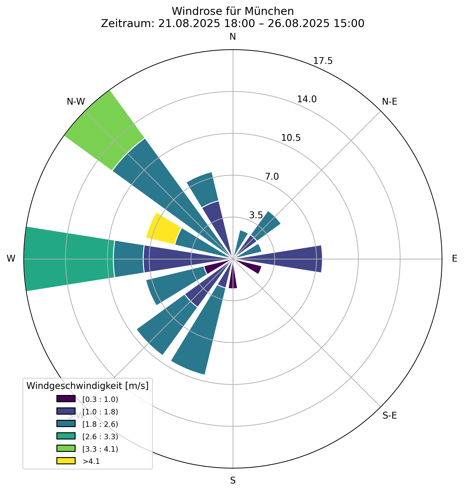

# 🌬️ Windrosen-Tool

Ein kleines Python-Projekt zur Visualisierung von Winddaten als **Windrose**.  
Die Daten werden automatisch über die [OpenWeatherMap API](https://openweathermap.org/api) abgerufen und lokal gecached, sodass unnötige API-Calls vermieden werden.  

## 📊 Features

- Abruf von Wetterdaten (Windgeschwindigkeit & Windrichtung) per OpenWeatherMap API  
- Unterstützung für Standortsuche per Stadtname oder Koordinaten (Breite/Länge)  
- Speicherung der Rohdaten als CSV (`data/weather_cache.csv`)  
- Erstellung und lokaler Speicherung einer **Windrose** mit Matplotlib & Windrose-Package  
- Einfache Anpassung der Stadt / Koordinaten  

## 🛠️ Installation

1. Repository klonen:
   
   ```bash
   git clone https://github.com/FTPico/Windrosen-Tool.git
   cd Windrosen-Tool
   ```

2. Virtuelle Umgebung erstellen und aktivieren:
   
   ```bash
   python -m venv .venv
   Windows (PowerShell)
   .venv\Scripts\activate
   Linux/Mac
   source .venv/bin/activate
   ```

3. Abhängigkeiten installieren:
   
   ```bash
   pip install -r requirements.txt
   ```

4. Eine .env-Datei im Projektordner erstellen und den API-Key eintragen:
   
   ```bash
   OWM_API_KEY = dein_api_key_hier
   ```

## ▶️ Nutzung

```bash
python src/main.py
```

## 📷 Beispiel Output

So sieht ein generierte Windrose für München im Zeitraum 21.08 - 26.08.2025 aus:


